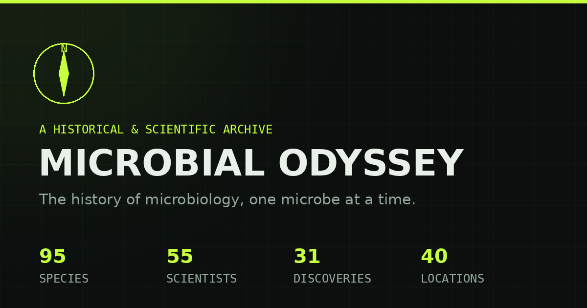

# Microbial Odyssey 🦑

A free, non-fictional archive of real microbiology history - real species, real scientists, real discoveries, and the real experiments and controversies that shaped our understanding of microbial life. No invented species, no fictional laboratories, no dramatized scenarios. Created by Zekraoui Rabah AllaaEddine.

## Sections

- **Species Archive** - 95 real microorganisms across bacteria, archaea, fungi, protozoa, algae, and viruses, each with a sourced discovery record
- **Scientists** - 55 real microbiologists and their documented contributions
- **Discoveries** - 31 landmark discoveries in microbiology history
- **Locations** - 40 real places, plotted on an interactive map with real coordinates
- **Experiments** - 12 landmark experiments structured by question, method, result, and significance
- **Controversies** - 6 real scientific controversies and 6 documented failed hypotheses, presented without a good-versus-bad narrative
- **Labs & Tools** - 8 historical laboratories and 10 tools that changed the field
- **Glossary** - 77 core microbiology terms
- **Timeline** - seven eras of microbiology history, from the first microscope to synthetic biology
- **Quiz** - a knowledge quiz generated live from the archive's own real data, no invented trivia

## Features

- Fully trilingual: English, French, Arabic (with RTL support)
- No login, no backend, no tracking - pure static site
- Global search (Ctrl/Cmd+K), species and scientist comparison tool, one-click citation export, faceted filtering
- Interactive map, daily "Microbe of the Day," Expedition Log progress tracker
- Every entry tagged with a confidence rating: well-documented, reasonably documented, or disputed

## Tech

Plain HTML/CSS/JavaScript. No build step, no framework dependencies. Uses Leaflet (map tiles) and Google Fonts via CDN. Deploy anywhere that serves static files.

## License / Contact

Free to use. Questions or feedback: reach out on [LinkedIn](https://www.linkedin.com/in/zekraouirabahallaaeddine), or see the Support page for voluntary contributions.

© 2026 Zekraoui Rabah Allaa Eddine 🦑. 
All Rights Reserved.
Unauthorized copying, reproduction, modification, redistribution, or commercial use of this project or its source code is prohibited. For permission, licensing, or other inquiries, contact the copyright holder.

